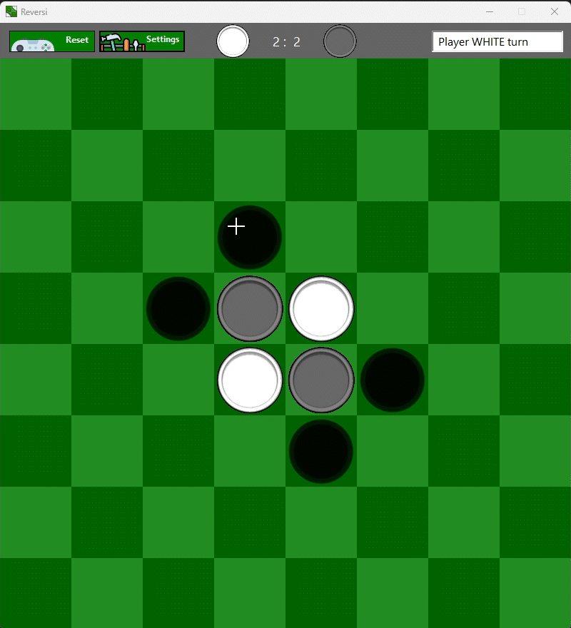
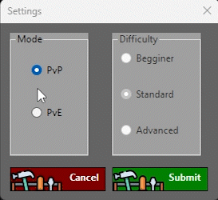

# Reversi
## Description
Reversi is a strategy board game for two players, played on an 8×8 uncheckered board. It was invented in 1883. Othello, a variant with a fixed initial setup of the board, was patented in 1971. [*](https://en.wikipedia.org/wiki/Reversi)

Featuring the local PvP and PvE game-modes, functional UI and one-hand controls.

## How To Play

1. Launch the app.
2. Choose the game mode:
 - Player vs Player (PvP)
 - Player vs AI (PvE)
3. (Optional) Adjust the difficulty level in the settings menu.
4. Click on a valid cell to make a move. The game will automatically flip the opponent's discs according to the rules of Reversi.
5. The game ends when no valid moves are available for either player. The player with the most discs on the board wins.

## Requirements
- **.NET 8.0 SDK** or higher
- Windows OS (Windows Forms is used for the GUI)

## Attribution
<a href="https://www.flaticon.com/free-icons/gaming" title="gaming icons">Gaming icons created by Flat Icons - Flaticon</a>

<a href="https://www.flaticon.com/free-icons/toolbox" title="toolbox icons">Toolbox icons created by Freepik - Flaticon</a>
